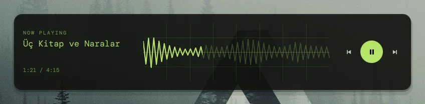
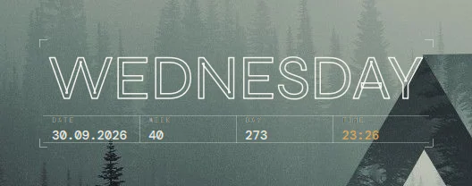
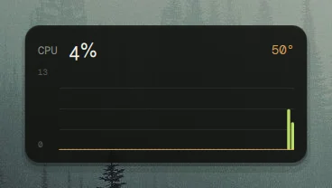
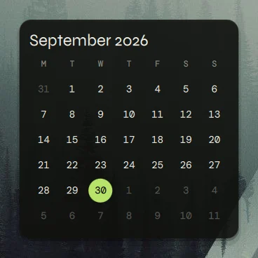

<div align="center">

# Desktop Widget Control

Live widgets for your Wayland desktop, with an editor to place and style them: clocks, system monitors, a media player, a calendar, weather and more. One [Quickshell](https://quickshell.org) config, no daemon, no other dependencies.

[](https://quickshell.org)
[](#requirements)
[](LICENSE)

[Türkçe README](README.tr.md) · [Architecture](docs/architecture.md) · [Write a widget](docs/writing-a-widget.md)


[Live site with every module in all nine themes](https://lunanoir21.github.io/desktop-widget-control/)

</div>

---

## What it is

Desktop Widget Control draws widgets on the desktop layer, above your wallpaper and below every window. Press one key and the desktop turns into an editor: drag widgets around a grid, resize them, change their options, pull new ones out of a library.

<div align="center">

</div>

- **17 modules**, each with a few sizes: six clocks, five system monitors, a media player, a calendar, weather, a pomodoro timer, a checklist and Claude / Codex usage limits.
- **A real editor.** Library with live thumbnails, drag and drop, cell snapping, resize by preset, an inspector generated from each module's options, duplicate, lock, delete, arrow-key nudging.
- **Styles.** Several modules have a *Style* option in the inspector; it swaps the whole look while the other options keep working.
- **Everything is an option.** Colours follow the theme or are set by hand; background, opacity, radius, padding, shadow and outline are per widget.
- **Nine themes**, Turkish and English.
- **Cheap.** Data sources only run while a widget needs them, and are shared between widgets. See [what it costs](#what-it-costs).
- **Scriptable.** Everything the editor does is also an IPC call, and the layout is one JSON file you can edit by hand (it is picked up live).
- **Independent.** It needs nothing from the rest of your shell. Fonts are bundled.

## Requirements

- [Quickshell](https://quickshell.org), developed and tested on 0.3.1 (Qt 6.11), built with Wayland support (the default).
- A compositor that supports `wlr-layer-shell`: Hyprland, Sway, river, niri, labwc and most other wlroots-style compositors. (GNOME's Mutter does not.)
- `curl`, only for the weather widget.
- `notify-send`, only if you want the pomodoro to notify.
- [`cava`](https://github.com/karlstav/cava), only for the media player's audio visualizer. Without it the option does nothing and nothing extra runs.

No Python, no Node, no Rust: the project is QML.

## Install

One line (needs [Quickshell](https://quickshell.org)):

```sh
curl -fsSL https://raw.githubusercontent.com/lunanoir21/desktop-widget-control/main/install.sh | sh
```

It fetches the project, links it in, adds an app-menu entry, offers the Hyprland autostart line and `Super+G` for the editor, and starts it. The first run opens a short tour. `dwc start` / `dwc toggle` from then on.

- **Omarchy:** `omarchy plugin add https://github.com/lunanoir21/desktop-widget-control-omarchy.git --enable`
- **Arch:** `cd packaging && makepkg -si`
- **By hand:**

```sh
git clone https://github.com/lunanoir21/desktop-widget-control
cd desktop-widget-control
./install.sh
```

`install.sh` links the folder into `~/.config/quickshell/desktop-widget-control` and puts a small `dwc` helper in `~/.local/bin`. `./install.sh --copy` copies instead of linking; `./install.sh --uninstall` removes both.

To try it without installing: `quickshell -p /path/to/desktop-widget-control`, or `make sandbox` (a throwaway config directory, so your layout is untouched).

### Start it with your session

Hyprland:

```conf
exec-once = quickshell -c desktop-widget-control
bind = SUPER, G, exec, dwc toggle
```

Sway: `exec quickshell -c desktop-widget-control` and `bindsym $mod+g exec dwc toggle`. Other compositors are the same two lines in their own syntax.

If you already run a Quickshell shell of your own, you do not need a second process: import the `ui` folder and add one `DwcHost {}` to your root (see [Use it inside your own shell](#use-it-inside-your-own-shell)).

## Using it

`dwc toggle` opens the editor; **Esc** or **Done** closes it.

| | |
|---|---|
| Add a widget | drag a card from the library onto the desktop, or double-click it |
| Move | drag it; it snaps to the grid and will not land on another widget |
| Resize | select it and drag the round grip at its corner, or pick S / M / L / W in the inspector |
| Change it | select it; the right panel shows its options and its appearance |
| Nudge | arrow keys |
| Duplicate / delete | `Ctrl+D` / `Del`, or the buttons at the bottom of the inspector |
| Lock | the padlock in the inspector keeps a widget from being moved by accident |
| Panels | they slide away by themselves while you drag something, and the inspector opens on the side away from the widget it edits; the bar at the top brings the library or the settings back, **Tab** hides both |
| Theme, language, grid size | the *Settings* tab of the inspector |

## Modules

| | Sizes | What it shows |
|---|---|---|
| **LED pixel** clock | M L W | dot-matrix time in three styles: classic, a dotted ring that fills with the seconds, or a day strip with the week and the 24 hours |
| **Analog** clock | S M L | vector face with optional second hand, date beside it |
| **Serif** clock | M L W | large italic time, once a minute |
| **Poster** clock | M L W | a lock-screen look, in three styles: classic (large spaced capitals, date and a small time), cut letters (the weekday sliced across the middle) and sign (an outlined weekday with a strip of date, week, day of the year and time); starts without a card so it sits on the wallpaper |
| **Mono + seconds** clock | S M | time, seconds bar, date and week number |
| **World clock** | M L | up to four time zones with the offset from yours |
| **CPU graph** | S M L | btop-style bars coloured by load (or a plain line), auto or fixed scale, optional second line (temperature or memory) |
| **RAM ring** | S M | use as a ring; used / total and swap when larger |
| **Disk** | S M | one bar per mount point, warns past a threshold |
| **Network** | S M W | download above, upload below a centre line, on one shared scale (or two plain lines) |
| **Temperature** | S M | half-circle gauge for the CPU sensor |
| **Media player** | S M L W X | any MPRIS player (Spotify, mpv, a browser…): cover, title, progress, buttons, and a live cava spectrum woven into the progress bar (or rising softly behind the card); a *Wide strip* style lays it all out in one row, click the bar to seek |
| **Calendar** | M L | month grid; today's date beside it when medium |
| **Weather** | S M L | current conditions and a forecast from Open-Meteo; pick a country and a city from a searchable list |
| **AI limits** | M W | the 5-hour and weekly limits of Claude and Codex, as twin rings or LED dots (see [AI limits](#ai-limits)) |
| **Pomodoro** | S M | focus / break timer; click the ring to start |
| **Notes** | M L | a checklist you can tick on the desktop |

Sizes are grid presets: S is 4×4 cells, M 8×4, L 8×8, W 12×4, and X 20×4 for a strip across the middle of the screen (a cell is 40 px by default, adjustable in Settings). The inspector has *Centre* buttons that put the selected widget in the middle of the screen, horizontally or vertically. Every module's options are listed in [`ui/js/Modules.js`](ui/js/Modules.js), and the inspector is built from that same list.

<div align="center">




</div>

## AI limits

The *AI limits* widget shows how much of the 5-hour and weekly limits you have used in Claude and Codex, as twin rings (outer = 5 hours, inner = week) or LED dots. It turns red above the warning level you set.

- **Codex** needs nothing: it reads the newest rate-limit line Codex wrote into `~/.codex/sessions`. The number is from the last time Codex ran, so it can be old; the widget says how old.
- **Claude** has two sources. By default it reads a capture of Claude Code's status line: point `statusLine` in `~/.claude/settings.json` at `ui/scripts/claude-statusline.sh` followed by your current status line command (the script's header explains it). It writes one file under `~/.local/state/desktop-widget-control/` and uses no network. If you use [flare](https://github.com/lunanoir21/flare) its capture works as well.
- **Claude: official API** (off by default) reads the token Claude Code keeps in `~/.claude/.credentials.json` and asks `api.anthropic.com/api/oauth/usage` every five minutes. That endpoint is not documented by Anthropic; switch it on only if you are comfortable with that.

The Claude and OpenAI marks are trademarks of their owners; this project is not affiliated with either company.

## Themes

`moss` (default), `umbra`, `black`, `graphite`, `paper`, `sand`, `gold`, `amber`, `crimson`. A theme is nine colours in [`ui/js/Themes.js`](ui/js/Themes.js); the tests check that text on the card and on the accent stays readable (WCAG AA) in every one. Colour options inside a widget are *tokens* (primary, secondary, text, muted) that follow the theme, or fixed swatches that do not.

## Scripting

`dwc` is a thin front for the IPC calls; `dwc help` lists them all.

```sh
dwc toggle                               # open / close the editor
dwc add media L                          # add a large media player
dwc set clock-led-1 seconds true         # an option (the value is JSON)
dwc style media-1 radius 24              # an appearance option
dwc move cpu-graph-1 4 6                 # to grid cell (4, 6)
dwc theme cycle                          # next theme
dwc list                                 # the layout as JSON
dwc hide                                 # hide every widget (dwc unhide brings them back)
dwc pause                                # stop every data source
```

The layout lives in `~/.config/desktop-widget-control/layout.json` (`$XDG_CONFIG_HOME` is honoured, and `DWC_CONFIG_DIR` overrides it). Edit it by hand and the desktop follows the moment you save. A file that cannot be read is kept as `layout.json.bad` and the first-run layout is used.

## Use it inside your own shell

```qml
import "path/to/desktop-widget-control/ui" as Dwc

ShellRoot {
    // your own bar, etc.
    Dwc.DwcHost {}
}
```

`DwcHost` creates the desktop layer and the editor on every screen and registers the `desktopWidgets` IPC target. Nothing else in the module reaches outside its own folder.

Compositor rules can target the layer by namespace: `desktop-widget-control` for the desktop, `desktop-widget-control-editor` for the editor. On Hyprland, for example, `layerrule = blur, desktop-widget-control` with `ignorealpha` frosts the widget cards.

## What it costs

The aim is that a desktop full of widgets costs almost nothing while you are not looking at it.

- **A data source runs only while a widget wants it**, at the fastest rate any of them asked for, and stops when the last one is removed. Ten widgets showing the CPU read `/proc/stat` once, not ten times. A desktop with no disk widget never runs `df`.
- **Widgets that show no seconds tick once a minute.** The clock precision follows what is on screen.
- **No blur, no shaders on the desktop.** The card shadow is two translucent rectangles, not an offscreen pass. Graphs are plain polylines on the GPU path renderer, capped at 60 points.
- **Input is narrow.** Only the rectangles of widgets that have buttons (media, pomodoro, notes) take the pointer; the rest of the screen is click-through.
- **The layout is written only when it changes**, 500 ms after the last edit.

Measured on the author's machine (1080p laptop, Quickshell 0.3.1, Qt 6.11) by [`tools/measure.py`](tools/measure.py), 20 seconds after start:

| | CPU (one core) | Memory (RSS) |
|---|---|---|
| first-run layout, 5 widgets | 0.2 % mean, 1 % peak | 254 MB |
| all 15 modules at once | 0.5 % mean, 2 % peak | 263 MB |
| the same, drawn above every window (never occluded) | 0.5 % mean, 2 % peak | 265 MB |

That is the process alone; it does not include the compositor's or the GPU's share. Most of the memory is Quickshell and Qt themselves, not the widgets: going from 5 to 15 widgets added under 10 MB. Measure on your own machine with `tools/measure.py $(pgrep -f desktop-widget-control)`.

## Project layout

```
shell.qml            the entry point Quickshell loads
ui/
  DwcHost.qml        the module's one public piece; creates everything, answers IPC
  DwcStore.qml       saved state: layout, theme, language (singleton)
  DwcData.qml        shared data sources with on-demand polling (singleton)
  DwcTheme.qml       colours and fonts (singleton)
  DwcLayer.qml       the desktop surface          DwcEditor.qml   the editor surface
  DwcFrame/Card      one widget on the desktop    DwcHandle.qml   its handle in the editor
  DwcLibrary/LibCard / DwcInspector / DwcOptionRow   the editor's panels
  widgets/           the 15 modules, one QML file each
  controls/          the small UI kit the editor uses
  js/                Layout, Modules (the catalogue), Themes, Strings, Icons: plain data and maths
  fonts/             bundled, SIL OFL
tests/               qmltestrunner + unittest        tools/   capture, showcase, measure
docs/                architecture and the widget guide
```

More in [docs/architecture.md](docs/architecture.md).

## Tests

```sh
tests/run.sh
```

Runs the QML tests (layout maths, the module catalogue, both languages' strings, theme contrast, icons) under Qt 6's `qmltestrunner` with no compositor, and the file-tree checks (every module has its file, every qmldir matches, no machine-specific paths). GitHub runs the same on every push.

## Contributing

Adding a module is one QML file and one entry in `ui/js/Modules.js`; the library, the inspector, the defaults and the tests pick it up. [docs/writing-a-widget.md](docs/writing-a-widget.md) walks through it. `AGENTS.md` has the project's conventions.

## Credits

Fonts: Syne, Instrument Sans, DM Mono, Newsreader and Doto, each under the SIL Open Font License (texts in `ui/fonts`). Weather data from [Open-Meteo](https://open-meteo.com), used without a key.

## License

[MIT](LICENSE).
