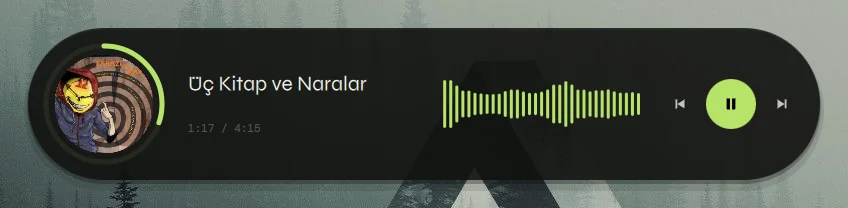
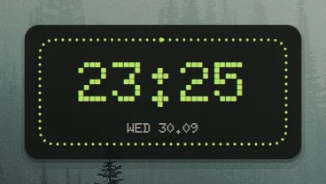
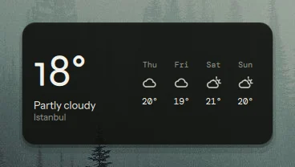
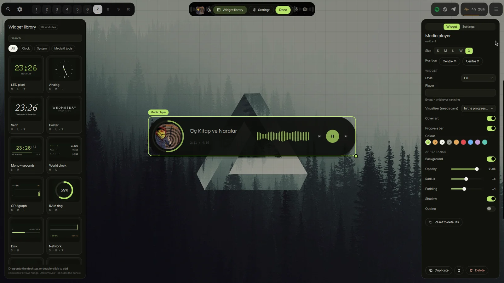

<div align="center">

# Desktop Widget Control

Wayland masaüstün için canlı widget'lar ve onları yerleştirip biçimlendirdiğin bir düzenleyici: saatler, sistem monitörleri, müzik oynatıcı, takvim, hava durumu ve daha fazlası. Tek bir [Quickshell](https://quickshell.org) yapılandırması; arka plan servisi yok, başka bağımlılık yok.

[English README](README.md) · [Mimari](docs/architecture.md) · [Widget yazmak](docs/writing-a-widget.md)






[Her modül dokuz temada: canlı site](https://lunanoir21.github.io/desktop-widget-control/)

</div>

---

## Ne yapar

Widget'ları masaüstü katmanına çizer: duvar kağıdının üstünde, tüm pencerelerin altında. Bir tuşa basınca masaüstü düzenleyiciye dönüşür; widget'ları ızgarada sürüklersin, boyutlandırırsın, seçeneklerini değiştirirsin, kütüphaneden yenilerini çekersin.

<div align="center">

</div>

- **17 modül**, her birinin birkaç boyutu var: altı saat, beş sistem monitörü, müzik oynatıcı, takvim, hava durumu, pomodoro, yapılacaklar listesi ve Claude / Codex kullanım limitleri.
- **Gerçek bir düzenleyici.** Canlı önizlemeli kütüphane, sürükle-bırak, hücreye yapışma, hazır boyutlarla yeniden boyutlandırma, her modülün seçeneklerinden otomatik üretilen özellik paneli, kopyalama, kilitleme, silme, ok tuşlarıyla kaydırma.
- **Stiller.** Birçok modülün panelde bir *Stil* seçeneği var; bütün görünümü değiştirir, diğer seçenekler çalışmaya devam eder.
- **Her şey bir seçenek.** Renkler temayı izler ya da elle seçilir; arka plan, opaklık, yarıçap, dolgu, gölge ve çerçeve widget başınadır.
- **Dokuz tema**, Türkçe ve İngilizce.
- **Ucuz.** Veri kaynakları yalnızca bir widget'a gerektiğinde çalışır ve widget'lar arasında paylaşılır. Bkz. [maliyeti](#maliyeti).
- **Betiklenebilir.** Düzenleyicinin yaptığı her şey bir IPC çağrısıdır; düzen tek bir JSON dosyasıdır, elle düzenlersen anında uygulanır.
- **Bağımsız.** Shell'inin geri kalanından hiçbir şey istemez. Fontlar pakette.

## Gereksinimler

- [Quickshell](https://quickshell.org), 0.3.1 (Qt 6.11) ile geliştirildi ve denendi; Wayland desteğiyle derlenmiş olmalı (varsayılan).
- `wlr-layer-shell` destekleyen bir compositor: Hyprland, Sway, river, niri, labwc ve benzeri wlroots tarzı compositor'ların çoğu. (GNOME'un Mutter'ı desteklemez.)
- `curl`, yalnızca hava durumu widget'ı için.
- `notify-send`, yalnızca pomodoro bildirim göndersin istersen.
- [`cava`](https://github.com/karlstav/cava), yalnızca müzik oynatıcının ses görselleştiricisi için. Yoksa seçenek bir şey yapmaz ve fazladan hiçbir şey çalışmaz.

Python, Node, Rust yok: proje QML.

## Kurulum

Tek satır ([Quickshell](https://quickshell.org) gerekir):

```sh
curl -fsSL https://raw.githubusercontent.com/lunanoir21/desktop-widget-control/main/install.sh | sh
```

Projeyi indirir, bağlar, uygulama menüsüne giriş ekler, Hyprland otomatik başlatmasını ve düzenleyici için `Super+G` tuşunu önerir ve başlatır. İlk açılışta kısa bir tur açılır. Sonra `dwc start` / `dwc toggle`.

- **Omarchy:** `omarchy plugin add https://github.com/lunanoir21/desktop-widget-control-omarchy.git --enable`

  > **Kısayolu ayarlamayı unutma.** Eklenti kendi başına bir tuş eklemez; tuş olmadan düzenleyiciyi açmanın yolu yok. Bir tuşu `qs ipc call desktopWidgets toggle` komutuna bağla; ilk açılış turu da senin için `SUPER + G` (doluysa ona benzer ilk boş tuş) eklemeyi önerir.

- **Arch:** `cd packaging && makepkg -si`
- **Elle:**

```sh
git clone https://github.com/lunanoir21/desktop-widget-control
cd desktop-widget-control
./install.sh
```

`install.sh` klasörü `~/.config/quickshell/desktop-widget-control` altına bağlar ve `~/.local/bin` içine küçük bir `dwc` yardımcısı koyar. `./install.sh --copy` bağlamak yerine kopyalar; `./install.sh --uninstall` ikisini de kaldırır.

Kurmadan denemek için: `quickshell -p /yol/desktop-widget-control` ya da `make sandbox` (geçici bir yapılandırma klasörü; düzenine dokunmaz).

### Oturumla birlikte başlat

Hyprland:

```conf
exec-once = quickshell -c desktop-widget-control
bind = SUPER, G, exec, dwc toggle
```

Sway: `exec quickshell -c desktop-widget-control` ve `bindsym $mod+g exec dwc toggle`. Diğer compositor'larda aynı iki satır kendi söz diziminde.

Zaten kendi Quickshell shell'ini çalıştırıyorsan ikinci bir süreç gerekmez: `ui` klasörünü içe aktar ve köküne bir `DwcHost {}` ekle ([Kendi shell'inin içinde](#kendi-shellinin-içinde)).

## Kullanım

`dwc toggle` düzenleyiciyi açar; **Esc** ya da **Bitti** kapatır.

| | |
|---|---|
| Widget ekle | kütüphaneden masaüstüne sürükle ya da kartına çift tıkla |
| Taşı | sürükle; ızgaraya yapışır ve başka bir widget'ın üstüne konmaz |
| Boyutlandır | seç, köşedeki yuvarlak tutamağı sürükle ya da panelden S / M / L / W seç |
| Değiştir | seç; sağ panel seçeneklerini ve görünümünü gösterir |
| Kaydır | ok tuşları |
| Kopyala / sil | `Ctrl+D` / `Del` ya da panelin altındaki düğmeler |
| Kilitle | paneldeki asma kilit, widget'ın yanlışlıkla taşınmasını engeller |
| Paneller | bir şey sürüklerken kendiliğinden kayıp gider, özellik paneli düzenlediği widget'ın karşı tarafında açılır; üstteki çubuk kütüphaneyi ya da ayarları geri getirir, **Tab** ikisini de gizler |
| Tema, dil, ızgara boyutu | panelin *Ayarlar* sekmesi |

## Modüller

| | Boyutlar | Ne gösterir |
|---|---|---|
| **LED piksel** saat | M L W | nokta-matris saat, üç stilde: klasik, saniyeyle dolan noktalı halka ya da haftayı ve günün 24 saatini gösteren gün şeridi |
| **Analog** saat | S M L | vektör kadran, isteğe bağlı saniye ibresi, yanında tarih |
| **Serif** saat | M L W | büyük italik saat, dakikada bir güncellenir |
| **Poster** saat | M L W | kilit ekranı görünümü, üç stilde: klasik (geniş aralıklı büyük harfler, tarih ve küçük saat), kesik harfler (gün adı ortadan kesik) ve afiş (çizgili gün adı, altında tarih, hafta, yılın günü ve saat şeridi); kartsız başlar, duvar kağıdının üstünde durur |
| **Mono + saniye** saat | S M | saat, saniye çubuğu, tarih ve hafta numarası |
| **Dünya saati** | M L | en çok dört saat dilimi ve seninkinden farkı |
| **CPU grafik** | S M L | yüke göre renkli btop tarzı çubuklar (ya da düz çizgi), otomatik ya da sabit ölçek, isteğe bağlı ikinci çizgi (sıcaklık ya da bellek) |
| **RAM halka** | S M | kullanım halka olarak; büyüyünce kullanılan / toplam ve swap |
| **Disk** | S M | bağlama noktası başına bir çubuk, eşik aşılınca uyarır |
| **Ağ** | S M W | orta çizginin üstünde indirme, altında yükleme, ortak ölçekte (ya da iki düz çizgi) |
| **Sıcaklık** | S M | CPU sensörü için yarım daire gösterge |
| **Müzik oynatıcı** | S M L W X | herhangi bir MPRIS oynatıcı (Spotify, mpv, tarayıcı…): kapak, başlık, ilerleme, düğmeler ve ilerleme çubuğuna işlenmiş (ya da kartın arkasından yumuşakça yükselen) canlı cava spektrumu; *Geniş şerit* stili her şeyi tek satıra dizer, çubuğa tıklayınca sarar |
| **Takvim** | M L | ay ızgarası; orta boyutta yanında bugünün tarihi |
| **Hava durumu** | S M L | Open-Meteo'dan anlık durum ve tahmin; ülke ve şehir aranabilir listeden seçilir |
| **YZ limitleri** | M W | Claude ve Codex'in 5 saatlik ve haftalık limitleri; çift halka ya da LED nokta ([YZ limitleri](#yz-limitleri)) |
| **Pomodoro** | S M | odak / mola sayacı; başlatmak için halkaya tıkla |
| **Notlar** | M L | masaüstünde işaretleyebileceğin bir liste |

Boyutlar ızgara hazırlarıdır: S 4×4 hücre, M 8×4, L 8×8, W 12×4, bir de ekranın ortasından geçen şerit için X 20×4 (bir hücre varsayılan olarak 40 px, Ayarlar'dan değişir). Özellik panelindeki *Ortala* düğmeleri seçili widget'ı ekranın ortasına, yatayda ya da dikeyde alır. Her modülün seçenekleri [`ui/js/Modules.js`](ui/js/Modules.js) içinde listelenir; özellik paneli de aynı listeden üretilir.

## YZ limitleri

*YZ limitleri* widget'ı Claude ve Codex'te 5 saatlik ve haftalık limitlerinin ne kadarını kullandığını çift halka (dış halka 5 saat, iç halka hafta) ya da LED nokta olarak gösterir. Belirlediğin uyarı eşiğini aşınca kırmızıya döner.

- **Codex** hiçbir şey istemez: Codex'in `~/.codex/sessions` içine yazdığı en yeni limit satırını okur. Değer Codex'in son çalıştığı andan kalmadır, eski olabilir; widget ne kadar eski olduğunu söyler.
- **Claude**'un iki kaynağı var. Varsayılan olarak Claude Code'un status line yakalamasını okur: `~/.claude/settings.json` içindeki `statusLine`'ı `ui/scripts/claude-statusline.sh` ve ardından mevcut status line komutuna yönlendir (script'in başındaki açıklama anlatır). `~/.local/state/desktop-widget-control/` altına tek bir dosya yazar, ağ kullanmaz. [flare](https://github.com/lunanoir21/flare) kullanıyorsan onun yakalaması da çalışır.
- **Claude: resmi API** (varsayılan kapalı) Claude Code'un `~/.claude/.credentials.json` içinde tuttuğu token'ı okur ve beş dakikada bir `api.anthropic.com/api/oauth/usage` adresine sorar. Bu uç nokta Anthropic tarafından belgelenmemiş; yalnızca bunu kabul ediyorsan aç.

Claude ve OpenAI logoları ilgili sahiplerinin ticari markasıdır; proje iki şirketle de bağlantılı değildir.

## Temalar

`moss` (varsayılan), `umbra`, `black`, `graphite`, `paper`, `sand`, `gold`, `amber`, `crimson`. Bir tema [`ui/js/Themes.js`](ui/js/Themes.js) içinde dokuz renktir; testler, kart üzerindeki ve vurgu üzerindeki yazının her temada okunaklı kaldığını denetler (WCAG AA). Widget içindeki renk seçenekleri temayı izleyen *token*'lar (birincil, ikincil, yazı, soluk) ya da izlemeyen sabit renklerdir.

## Betikleme

`dwc`, IPC çağrılarının ince bir önyüzüdür; `dwc help` hepsini listeler.

```sh
dwc toggle                               # düzenleyiciyi aç / kapat
dwc add media L                          # büyük bir müzik oynatıcı ekle
dwc set clock-led-1 seconds true         # bir seçenek (değer JSON'dur)
dwc style media-1 radius 24              # bir görünüm seçeneği
dwc move cpu-graph-1 4 6                 # (4, 6) ızgara hücresine
dwc theme cycle                          # sonraki tema
dwc list                                 # düzen JSON olarak
dwc hide                                 # tüm widget'ları gizle (dwc unhide geri getirir)
dwc pause                                # tüm veri kaynaklarını durdur
```

Düzen `~/.config/desktop-widget-control/layout.json` içinde durur (`$XDG_CONFIG_HOME` dikkate alınır, `DWC_CONFIG_DIR` ile değiştirilir). Elle düzenlersen masaüstü kaydettiğin anda uyar. Okunamayan dosya `layout.json.bad` olarak saklanır ve ilk açılış düzeni kullanılır.

## Kendi shell'inin içinde

```qml
import "yol/desktop-widget-control/ui" as Dwc

ShellRoot {
    // kendi bar'ın vb.
    Dwc.DwcHost {}
}
```

`DwcHost` her ekranda masaüstü katmanını ve düzenleyiciyi oluşturur ve `desktopWidgets` IPC hedefini kaydeder. Modülün başka hiçbir parçası kendi klasörünün dışına uzanmaz.

Compositor kuralları katmanı ad alanıyla hedefleyebilir: masaüstü için `desktop-widget-control`, düzenleyici için `desktop-widget-control-editor`. Hyprland'de örneğin `layerrule = blur, desktop-widget-control` ve `ignorealpha` widget kartlarını buzlu yapar.

## Maliyeti

Amaç, sen bakmazken widget dolu bir masaüstünün neredeyse hiçbir şeye mal olmaması.

- **Bir veri kaynağı yalnızca bir widget istediği sürece çalışır**, isteyenlerin en hızlısının hızında; sonuncusu kaldırılınca durur. CPU'yu gösteren on widget `/proc/stat`'ı on kez değil bir kez okur. Disk widget'ı olmayan masaüstü `df` çalıştırmaz.
- **Saniye göstermeyen widget'lar dakikada bir günceller.** Saat hassasiyeti ekrandakine göre ayarlanır.
- **Masaüstünde blur ve shader yok.** Kart gölgesi iki yarı saydam dikdörtgendir, ekran dışı geçiş değil. Grafikler GPU yol çizicisinde düz çoklu çizgilerdir, en çok 60 nokta.
- **Girdi dar.** Yalnızca düğmesi olan widget'ların (müzik, pomodoro, notlar) dikdörtgenleri fareyi alır; ekranın geri kalanı tıklamayı geçirir.
- **Düzen yalnızca değişince yazılır**, son düzenlemeden 500 ms sonra.

Yazarın makinesinde (1080p dizüstü, Quickshell 0.3.1, Qt 6.11) [`tools/measure.py`](tools/measure.py) ile ölçüldü, başladıktan 20 saniye sonra:

| | CPU (tek çekirdek) | Bellek (RSS) |
|---|---|---|
| ilk açılış düzeni, 5 widget | ort. %0,2, tepe %1 | 254 MB |
| 15 modülün hepsi aynı anda | ort. %0,5, tepe %2 | 263 MB |
| aynısı, tüm pencerelerin üstünde çizilirken (hiç örtülmeden) | ort. %0,5, tepe %2 | 265 MB |

Bu yalnızca sürecin kendisi; compositor'ın ya da GPU'nun payı dahil değil. Belleğin çoğu widget'lar değil Quickshell ve Qt'nin kendisi: 5'ten 15 widget'a geçmek 10 MB'tan azını ekledi. Kendi makinende ölçmek için: `tools/measure.py $(pgrep -f desktop-widget-control)`.

## Testler

```sh
tests/run.sh
```

QML testlerini (yerleşim matematiği, modül kataloğu, iki dilin metinleri, tema kontrastı, ikonlar) Qt 6'nın `qmltestrunner`'ı ile compositor olmadan, dosya ağacı denetimlerini (her modülün dosyası var, her qmldir eşleşiyor, makineye özgü yol yok) unittest ile çalıştırır. GitHub aynısını her push'ta çalıştırır.

## Katkı

Modül eklemek bir QML dosyası ve `ui/js/Modules.js` içinde bir kayıttır; kütüphane, özellik paneli, varsayılanlar ve testler bunu kendiliğinden alır. [docs/writing-a-widget.md](docs/writing-a-widget.md) baştan sona anlatır. Projenin kuralları `AGENTS.md` içinde.

## Lisans

[MIT](LICENSE). Fontlar (Syne, Instrument Sans, DM Mono, Newsreader, Doto) SIL Open Font License altındadır; metinleri `ui/fonts` içinde. Hava durumu verisi [Open-Meteo](https://open-meteo.com)'dan, anahtarsız.
